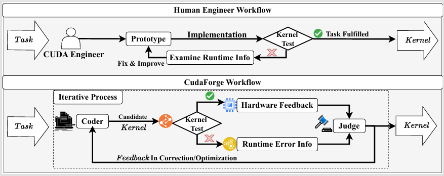

# CudaForge: MCP Multi-Agent Finetuning Framework

CudaForge is now focused on multi-agent finetuning workflows powered by MCP-style tooling.
The core goal is to orchestrate a planner, coder, and feedback agent to design, implement,
and improve task-specific finetuning runs.



## 🔧 Build Environment
```
conda env create -f environment.yml
```

Note: Some packages may fail to install automatically when creating the environment.
If that happens, please install the missing packages manually using conda install or pip install.
```
pip install torch
pip install openai
pip install pandas
pip install matplotlib
pip install datasets peft bitsandbytes trl
```

For Hugging Face datasets or model downloads, set `HF_TOKEN` if needed.
## 🧩 MCP Multi-Agent Finetuning Workflow

This repo includes a starter MCP-style multi-agent workflow (planner → coder → feedback)
for finetuning tasks. It scans a lightweight model catalog, drafts a finetuning plan,
generates a training script, runs it, and asks a feedback agent for the next iteration.

Example run:

```bash
python3 mcp_main.py "Finetune a lightweight chat model for customer support classification" \
  --server_type openai \
  --model_name o3-mini \
  --model_catalog mcp/model_catalog.json
```

### MCP Backend Notes


